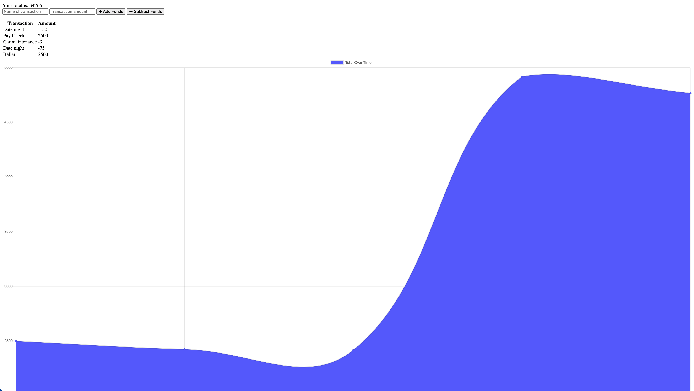

# BudgetTracker

AS AN avid traveller I WANT to be able to track my withdrawals and deposits with or without a data/internet connection SO THAT my account balance is accurate when I am traveling. Giving users a fast and easy way to track their money is important, but allowing them to access that information anytime is even more important. Having offline functionality is paramount to our applications success.

## Description

We were tasked to build an online/offline budget tracker with the provided code.

## Table of Contents

- [Installation](#installation)
- [Usage](#usage)
- [Contribution](#contribute)
- [Testing](#tests)
- [License](#license)
- [Questions](#questions)

## Installation

Be sure to install: npm i compression express lite-server mongoose morgan

## Usage

Use but give credit

## License

This repository is licensed under the  license.

## Contribute

Contribute as see you applicable, but make sure they're awesome contributions

## Testing

npm test

## Screenshot

## Questions

Any comments, questions, concerns? Feel free to contact me at [mwebb2321@gmail.com](mailto:mwebb2321@gmail.com).
My gitHub profile is [MWebb2321](https://github.com/MWebb2321)
